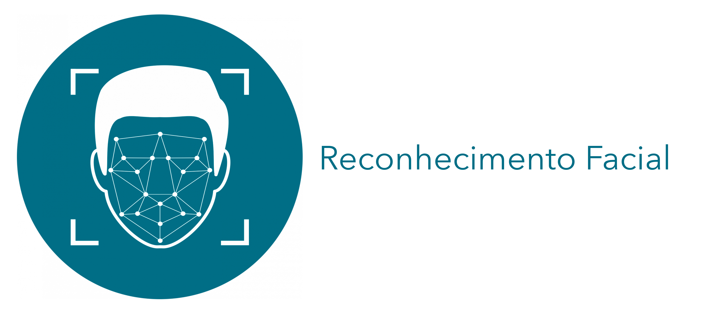

# Projeto de Reconhecimento Facial com MediaPipe

Este é um projeto de reconhecimento facial que utiliza a biblioteca MediaPipe para detecção de pontos faciais e reconhecimento facial em tempo real. Ele pode ser usado para identificar pessoas em uma transmissão de vídeo ao vivo ou em imagens estáticas.

## Pré-requisitos

Antes de começar, certifique-se de que você tenha o Python instalado em sua máquina. Além disso, instale as seguintes bibliotecas:

- OpenCV
- dlib
- NumPy

Você também precisará dos modelos treinados do MediaPipe e do dlib para detecção de pontos faciais e reconhecimento facial. Você pode baixá-los nos seguintes links:

- [MediaPipe Face Detection Model](https://github.com/google/mediapipe/blob/master/mediapipe/modules/face_detection/face_detection_front.tflite)
- [shape_predictor_68_face_landmarks.dat](http://dlib.net/files/shape_predictor_68_face_landmarks.dat.bz2)
- [dlib_face_recognition_resnet_model_v1.dat](http://dlib.net/files/dlib_face_recognition_resnet_model_v1.dat.bz2)

Certifique-se de descompactar e salvar esses modelos na pasta do seu projeto.

## Como Usar

1. Clone este repositório em sua máquina local:

2. Navegue até a pasta do projeto:

3. Execute o script Python:

Isso iniciará o aplicativo de reconhecimento facial em tempo real.

4. Pressione a tecla 'q' para sair do aplicativo.

## Personalização

Você pode personalizar este projeto de acordo com suas necessidades:

- Adicione mais rostos conhecidos à lista `nomes_conhecidos` no código.
- Ajuste os valores de limite de similaridade para obter o melhor desempenho em seu caso de uso específico.

## Licença

Este projeto está sob a licença [MIT](LICENSE). Sinta-se à vontade para usá-lo e modificá-lo conforme necessário.

## Contribuições

Contribuições são bem-vindas! Se você encontrar problemas ou tiver melhorias a serem sugeridas, abra uma [issue](https://github.com/thiagolopes-dev/reconhecimento_facial/issues) ou envie uma solicitação de [pull](https://github.com/thiagolopes-dev/reconhecimento_facial/pulls).

## Contato

Se você tiver alguma dúvida ou precisar de ajuda com este projeto, sinta-se à vontade para entrar em contato com [thiagolopes-dev](https://github.com/thiagolopes-dev) através do GitHub.

- [@thiagolopes-dev](https://github.com/thiagolopes-dev)

Divirta-se com seu projeto de reconhecimento facial!